## L'écosystème JavaScript pour la cartographie libre et Open Source

par [@ThomasG77](https://twitter.com/ThomasG77),
[WebGeoDataVore](http://webgeodatavore.com)


---

# Qui je suis?

Consultant SIG avec plus de 10 ans d'expérience.
Mes activités sont du conseil, de la formation et du développement.

J'ai écrit un livre sur [OpenLayers 3](https://www.packtpub.com/web-development/openlayers-3-beginner%E2%80%99s-guide) (en anglais)

Spécialiste JavaScript et Python.

---

# Historique

----

## Evolution du web

* Historiquement pour améliorer les interactions côté client
* Découplage client-serveur pour l'affichage

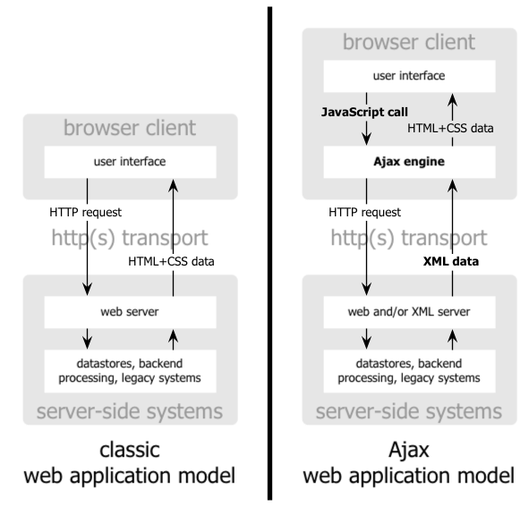

----

## JavaScript: petite revue historique

Pensé pour le développement web côté navigateur

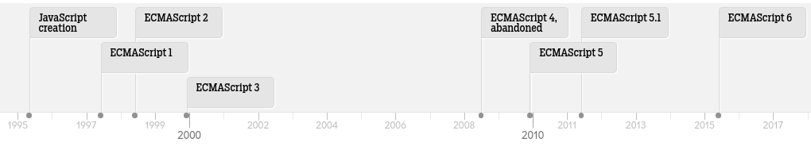

----

## JavaScript: l'asynchronicité

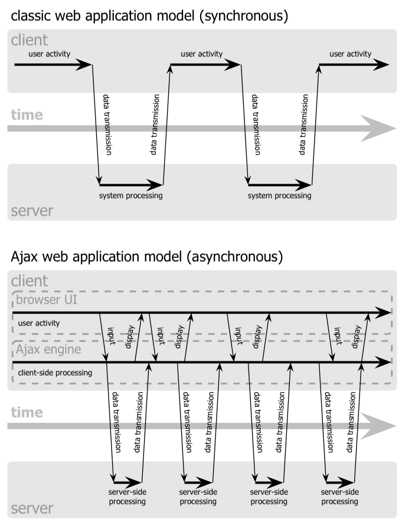

---

# JavaScript côté affichage cartographique

----

## De l'affichage 2D SVG/Canvas...

* D3 <br>
* Leaflet <br>
* OpenLayers <br>

Nombreuses autres solutions basées sur le SVG.

----

## ... à l'affichage WebGL 2D/3D

* MapBoxGL <br>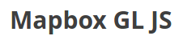
* Tangram <br>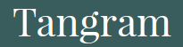
* Globe 3D Cesium <br>

---

# Vers de nouveaux usages

---

# Les "ruptures" côté JavaScript

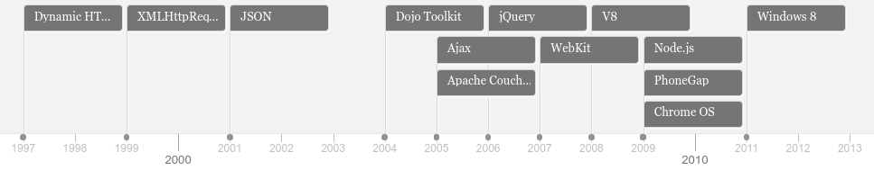

---

# Tendance 1

## Surcouches à des binding C/C++ via Node

----

## Pour le traitement

* Binding [node-gdal](https://github.com/naturalatlas/node-gdal/)
* Binding [node-osmium](https://github.com/osmcode/node-osmium/) pour manipuler les données OSM

----

## Rendu serveur

  * Binding Mapnik et serveurs de tuiles basés sur Mapnik (exemple avec [tilelive-mapnik](https://github.com/mapbox/tilelive-mapnik))
  * Binding MapServer avec 2 implémentations ([Pagameba](https://github.com/pagameba/node-mapserver) et [GeoData Institute](https://github.com/geo-data/node-mapserv)) ainsi que [Mapcache](https://github.com/geo-data/node-mapcache)

---

# Tendance 2

## Gestion de dépendances

----

```javascript
var ol = require('openlayers');

var map = new ol.Map({
  target: 'map',
  layers: [
    new ol.layer.Tile({
      source: new ol.source.OSM()
    })
  ],
  view: new ol.View({
    center: [0, 0],
    zoom: 0
  })
});
```
 ##+

```bash
browserify index.js > out.js
```

----

## Intérêts

* Utilise Node via NPM (gestionnaire de paquets de Node) pour créer du code client
* Modularisation du code
* Création de module indépendant (exemples actuels: certains plugins Leaflet ou OpenLayers)

Basés sur les standards: UMD, CommonJS, RequireJS, module JavaScript natif (ES6/ES2015)

----

## Outils

* [Browserify](http://browserify.org/)
* [WebPack](https://webpack.github.io)
* [JSPM](http://jspm.io)
* [BabelJS](https://babeljs.io)

---

# Tendance 3

## Le GeoJSON à toutes les sauces

----

## [GeoJSON, nouveau lingua franca en géomatique?](http://www.portailsig.org/content/geojson-nouveau-lingua-franca-en-geomatique)

*Martin Laloux* sur PortailSIG

* Rejet de la complexité OGC (XML, namespaces inutiles pour beaucoup de cas d'usage simple)
* Format cartographique cartographique interopérable, orienté web

----

## Pas d'exemples dans cette présentation?

En fait, il y a de nombreux exemples de bibliothèques via un inventaire appelé [awesome-geojson](https://github.com/tmcw/awesome-geojson).

Nous ne développons pas ici: cette tendance se croise avec d'autres et on va voir quelques exemples ultérieurement.

---

# Tendance 4

## "Universal" JavaScript (avant appelé aussi "JavaScript isomorphique")

----

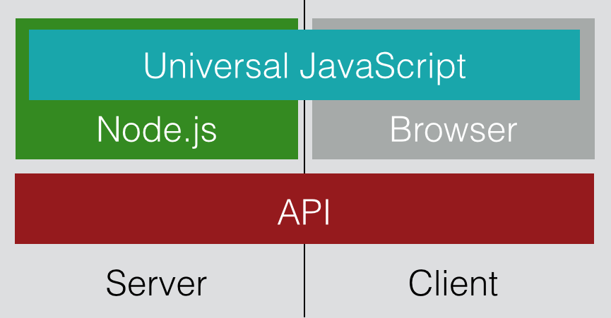

----

# Données

----

## Traitements

  * [JSTS](https://github.com/bjornharrtell/jsts/) (bas niveau)

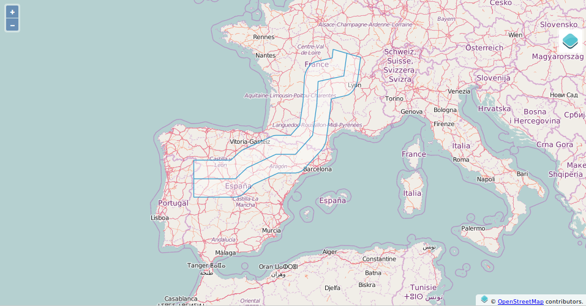

----

  * [Turf](https://github.com/Turfjs/turf) (haut niveau)

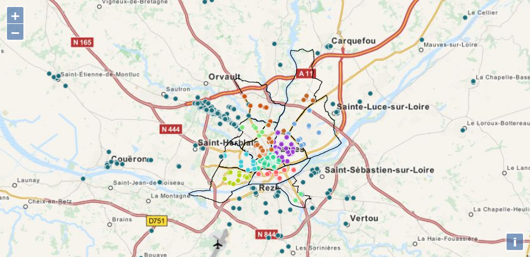

----

## Sérialisation-désérialisation de données en JS

* **[JSONIX](https://github.com/highsource/jsonix) pour les standards OGC**
* Support des lecture-écriture de tuiles vecteur avec [pbf](https://github.com/mapbox/pbf) et [vector-tile](https://github.com/mapbox/vector-tile-js)
* Les différentes dépendances de [Leaflet-Omnivore](https://github.com/mapbox/leaflet-omnivore) pour transformer CSV, WKT, GPX ou KML en GeoJSON.
* [OSMtoGeoJSON](https://github.com/tyrasd/osmtogeojson) pour passer des données OSM en GeoJSON
* [TerraFormer](https://github.com/Esri/Terraformer) Fait par ESRI. Peut lire des géométries ESRI JSON

----

## Simplification/optimisation de données

* [MapShaper](http://mapshaper.org) avec [code sur Github](https://github.com/mbloch/mapshaper)
  <br>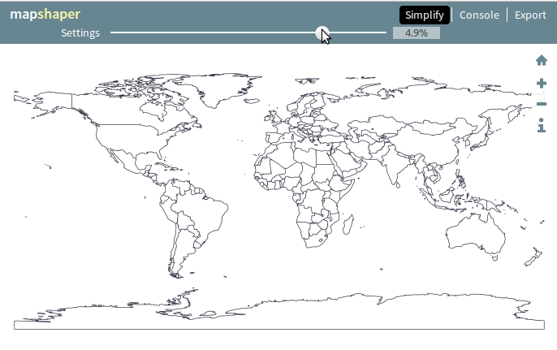

* [TopoJSON](https://github.com/mbostock/topojson)

----

# Représentations

----

## Projections

  * [proj4js](http://proj4js.org) avec [EPSG.io](http://epsg.io)

----

## Discrétisation

  * **[Geostats](https://github.com/simogeo/geostats)**: méthodes de classification principales
    <br><a href="http://labs.webgeodatavore.com/d3-workshop/demos/03-chroplethe-carto-depts-france-topojson.html" target="_blank">
    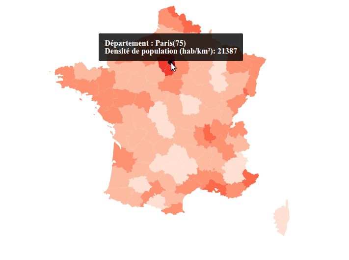
    </a>
  * [Simple statistics](http://simplestatistics.org) Implémentation par exemple des quantiles ou des ckmeans (similaire à Jenks) par exemple. Bibliothèque principalement orientée statistiques

----

## Gestion des couleurs

* [Chroma.js](https://github.com/gka/chroma.js) qui inclue les couleuts de ["ColorBrewer"](http://colorbrewer2.org)

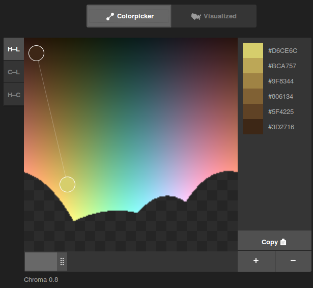

----

* [D3 scale](https://github.com/d3/d3-scale) couvrant échelles et couleurs

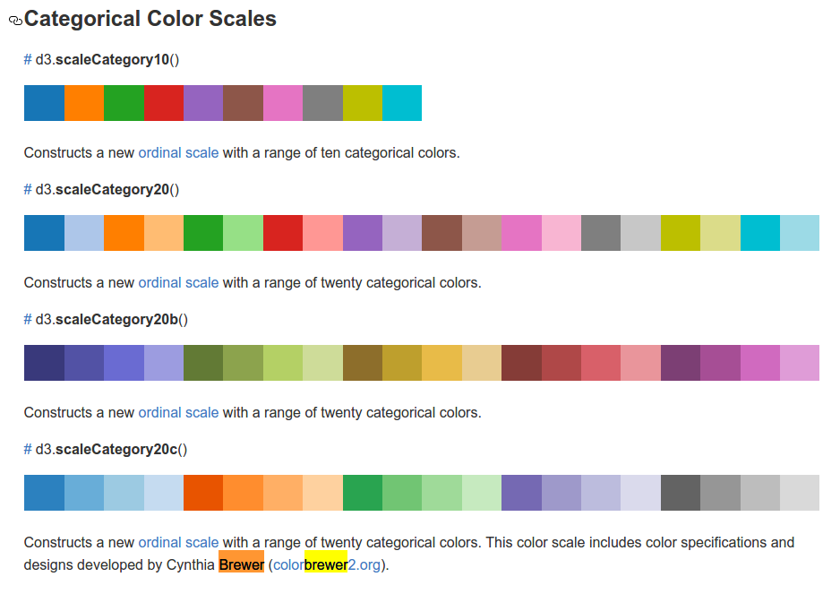

---

# Tendance 5

## Génération de carte côté serveur depuis du code client

----

<a href="http://madrona.ecotrust.org/news/map-printing/" target="_blank">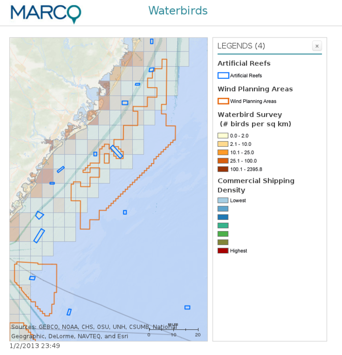</a>

----

## Intérêts

* profiter de la vitesse de calcul d'une exécution en ligne de commande
* générer des cartes par "batch".

----

## Outils

* [phantomJS](http://phantomjs.org) (basé sur Webkit) Navigateur dit "headless", pensez "lancement de votre navigateur sans l'affichage visuel"
* [jsdom](https://github.com/tmpvar/jsdom/) qui simule dans Node le DOM (indisponible sinon en contexte serveur)


---

# Tendance 6

## Plus d'utilitaires en ligne de commande ou de données accessibles via JavaScript

----

## Données via des bibliothèques JavaScript

* [GeoJSON.xyz](https://github.com/geojson-xyz/geojson-xyz): récupération de données Monde

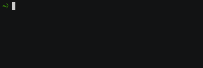

----

* [Query Overpass](https://github.com/perliedman/query-overpass) Interrogation de données OpenStreetMap via l'Overpass API

```bash
echo '[out:json];node(57.7,11.9,57.8,12.0)[amenity=bar];out;' | query-overpass | python -mjson.tool
```

```
{
    "features": [
        {
            "geometry": {
                "coordinates": [
                    11.9643378,
                    57.7064417
                ],
                "type": "Point"
            },
            "id": "node/2318390720",
            "properties": {
                "id": 2318390720,
...
```

----

## Bibliothèques contenant des données

* [Codes postaux](https://github.com/sgmap/codes-postaux) Liste des codes postaux
* [Node Maxmind](https://github.com/runk/node-maxmind) Liste des IP associés à des lieux géographiques

---

# Tendance 7

## HTML devient bureautique

----

## Points communs entre

----

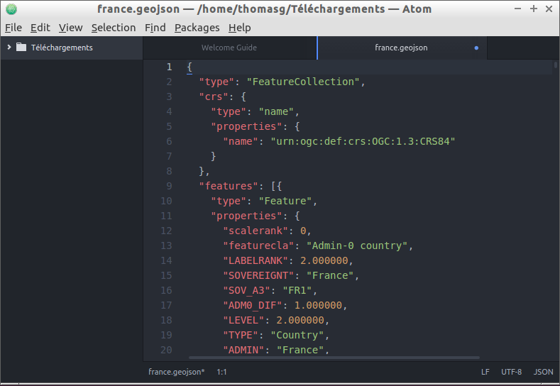

----


----

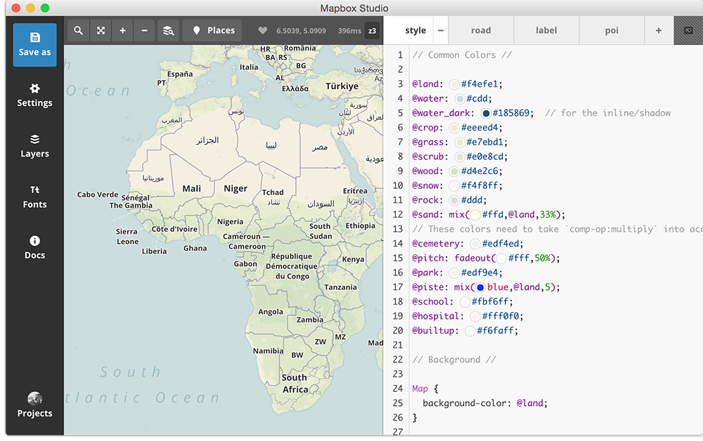

----

## Solution:

Tous ces outils utilisent une bibliothèque nommée Electron

## Intérêts

* L'encapsulation d'un contenu web dans une application bureautique en ayant les accès à la ressource machine.

Analogie avec les applications natives de votre "smartphone"

----

## Outils

* [Electron](http://electron.atom.io)
* [NW.js](http://nwjs.io/)

---

Questions?

---

## Bonus

* Piloter votre drône avec JavaScript avec l'initiative [NodeCopter](http://www.nodecopter.com/)
* ASCII Maps avec [geotype](https://github.com/morganherlocker/geotype)

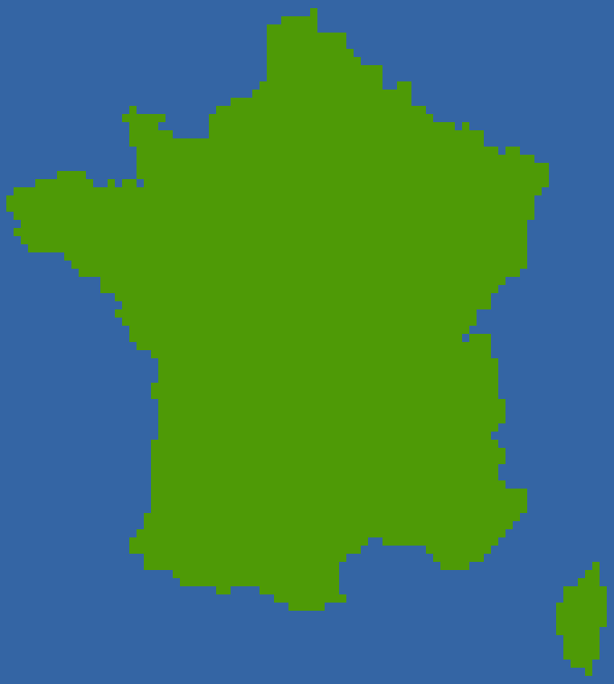
